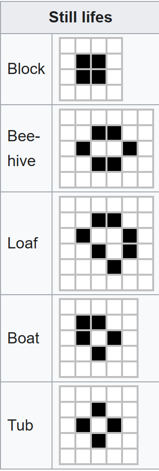
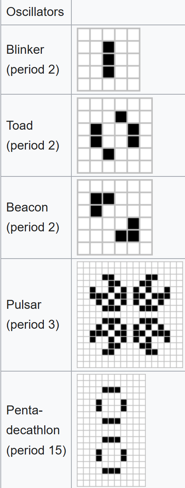

# Game-of-Life
# Description
This program simulates Game Of Life in the terminal. Inspired by [Robert Heaton](https://robertheaton.com/2018/07/20/project-2-game-of-life/).
According to [wikipedia](https://en.wikipedia.org/wiki/Conway%27s_Game_of_Life), the rules are as follows.
1. Any live cell with fewer than two live neighbours dies, as if by underpopulation.
2. Any live cell with two or three live neighbours lives on to the next generation.
3. Any live cell with more than three live neighbours dies, as if by overpopulation.
4. Any dead cell with exactly three live neighbours becomes a live cell, as if by reproduction.
Soups are 

# Usage
To create a random state of live and dead cells, type the command `python main.py random` in terminal.  

To create a pattern, specify its pattern name and x, y coordinates (top left is (0, 0)).  
Type the command `python main.py pattern_name x y` in terminal.  
Note that pattern_name must be typed exactly as one of the pattern names shown in the list below.

# Patterns
Here are the pattern names along with their images.
## Still Lifes
Patterns that stay the same
- block
- beehive
- loaf
- boat
- tub  

## Oscillators
Patterns that go back and forth between different states
- beacon
- blinker
- toad
- pulsar
- penta-decathlon  

## Spaceships
Patterns that travel across the board
- glider
- LWSS (light-weight spaceship)
- MWSS (middle-weight spaceship)
- HWSS (heavy-weight spaceship)  
